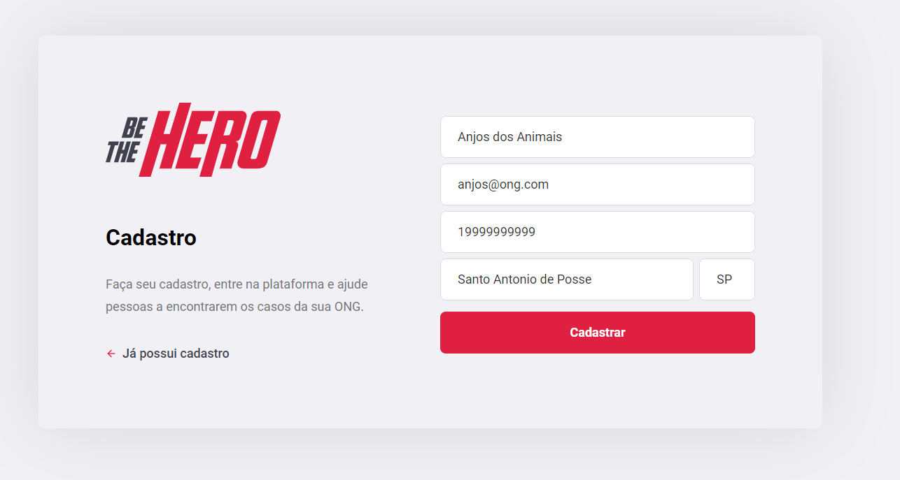
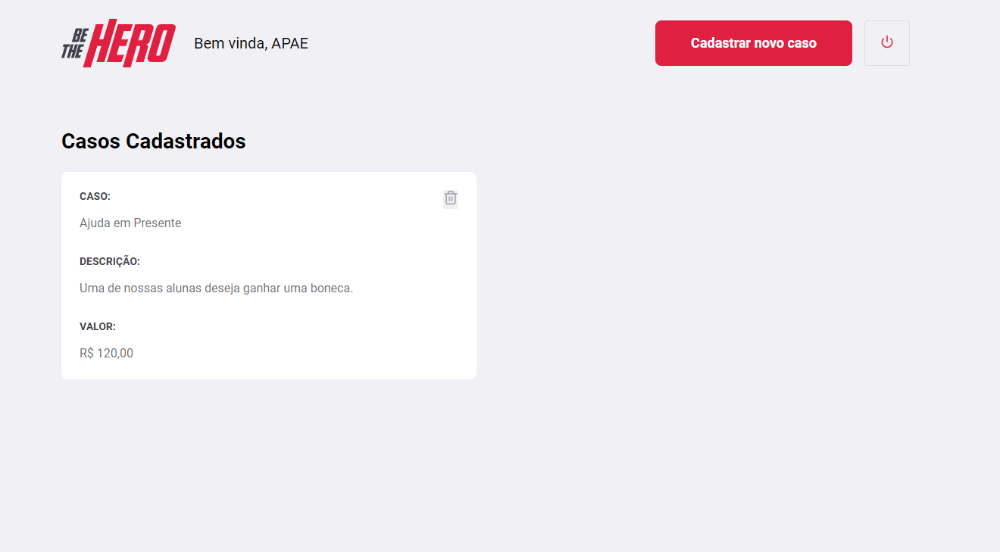
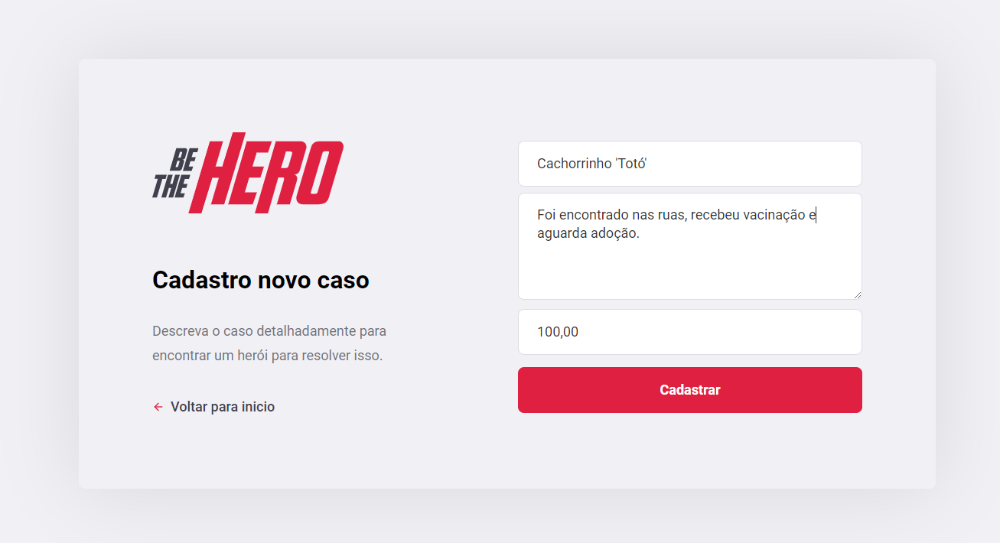
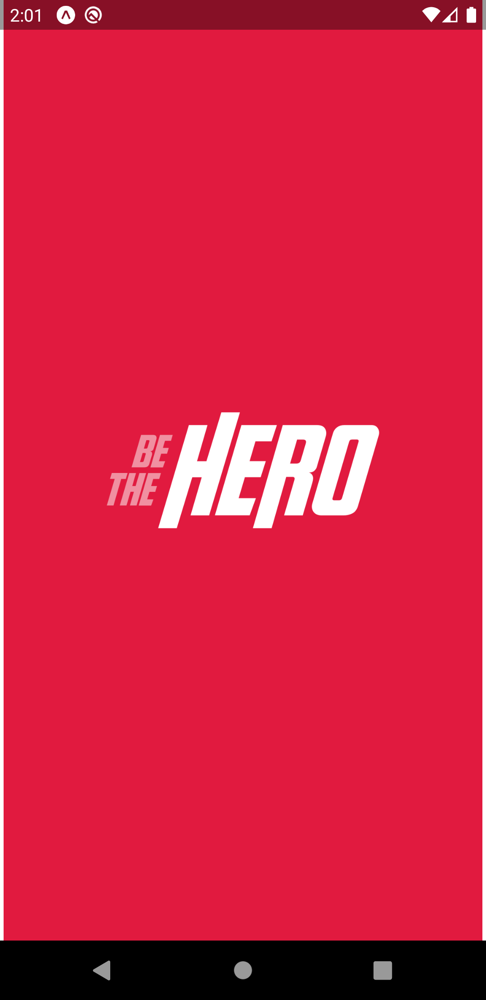
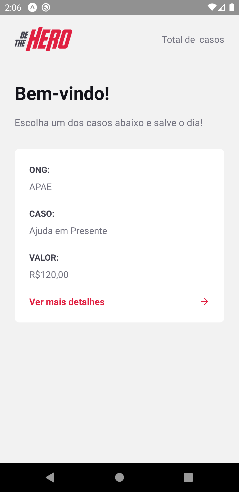
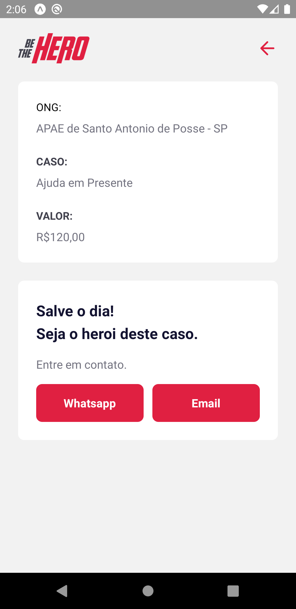

[Rocketseat](https://rocketseat.com.br/)

  ### Desenvolvida por: [Emerson Pereira da Silva](https://www.linkedin.com/in/emerson-silva-b266b840)

### Professor: [Diego Fernandes](https://www.linkedin.com/in/diego-schell-fernandes)

# Aplicação desenvolvida em três etapas:

1.  Backend - [hospedado no heroku](https://be-the-heroes-backend.herokuapp.com) - [repositório Git](https://github.com/eps364/omnistack-11-backend)

 2.  Frontend - [hospedado no heroku](https://be-the-heroes-frontend.herokuapp.com) - [repositório Git](https://github.com/eps364/omnistack-11-frontend)

 3. Mobile - [repositório Git](https://github.com/eps364/omnistack-11-mobile)

Não foi gerado o apk (https://be-the-heroes-mobile.herokuapp.com/)

------------
## Para hospedar no Heroku
Usar o buildpacks on Heroku Elements `mars/create-react-app`

Adicionado no package.json
`
"engines": {
    "node": "12.16.x"
  },
  `
Adicionado no app.json
`
{

"buildpacks": [
    {
        "url": "https://github.com/mars/create-react-app-buildpack"
    }
    ]
}
`